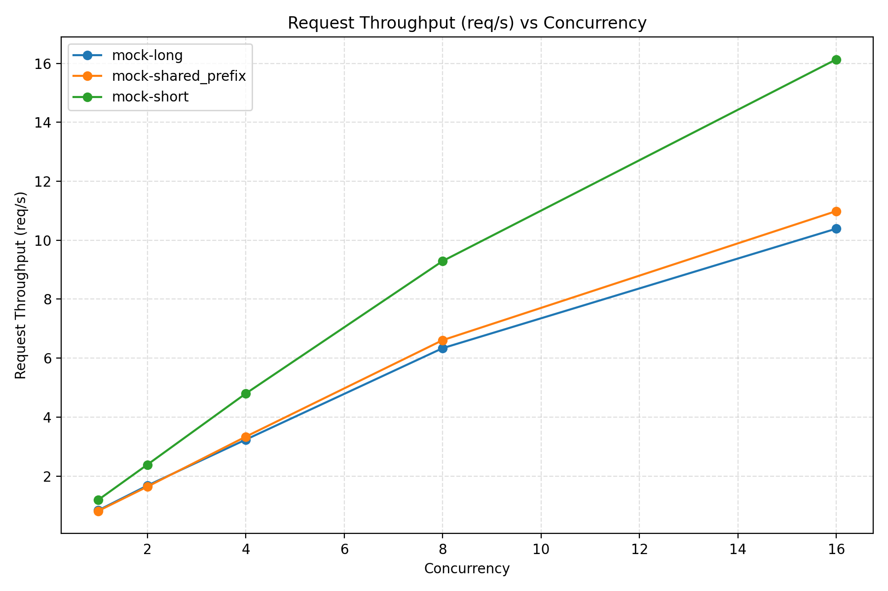
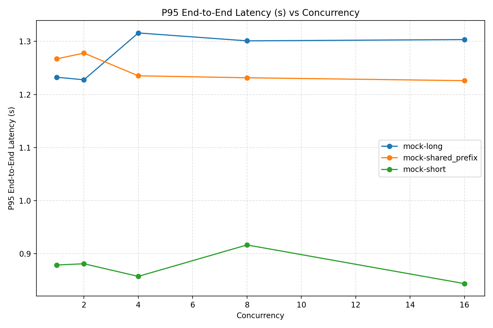
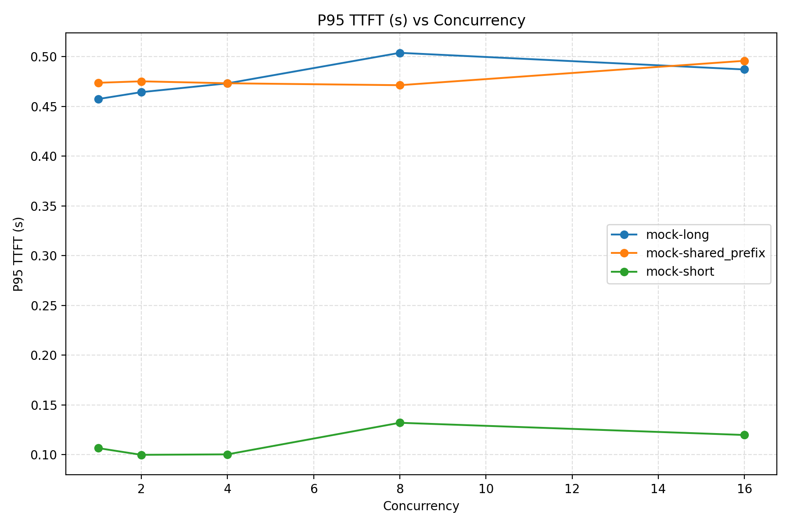
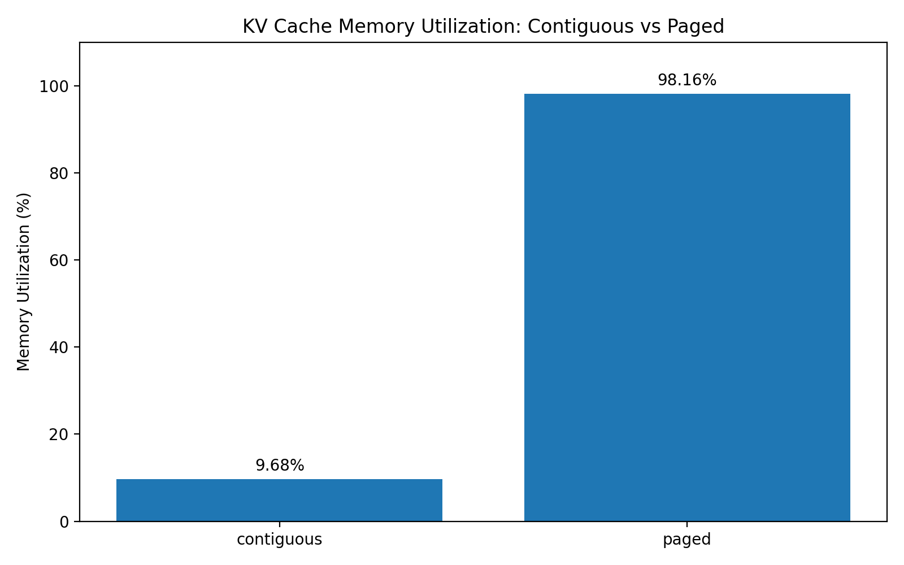
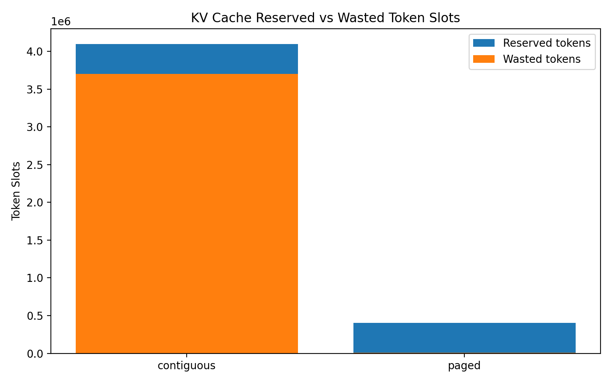
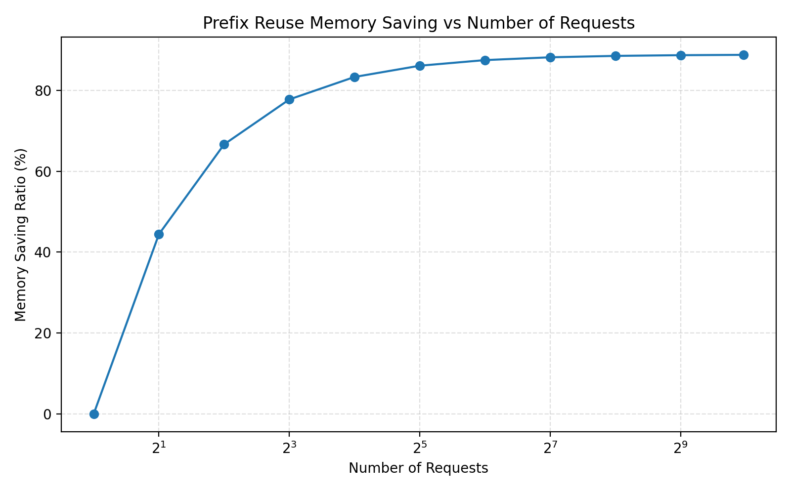

# LLM Serving Benchmark and KV Cache Scheduling Analysis with vLLM and SGLang

This project evaluates LLM serving performance across vLLM and SGLang under different workloads, with a focus on throughput, latency, prefill/decode behavior, prefix caching, and KV cache memory management.

## Tech Stack

- Python
- vLLM
- SGLang
- OpenAI-compatible API
- Async benchmarking
- KV cache allocator simulation
- Docker
- Qwen2.5-7B-Instruct

## Goals

1. Deploy OpenAI-compatible LLM serving engines with vLLM and SGLang.
2. Build custom workloads for short prompts, long prompts, and shared-prefix scenarios.
3. Measure request throughput, output tokens/s, TTFT, TPOT, ITL, and P95/P99 latency.
4. Compare prefix caching behavior in vLLM and SGLang.
5. Implement a KV cache block allocator simulator inspired by PagedAttention.

## Workloads

| Workload | Description | Main Bottleneck |
|---|---|---|
| A | Short prompt, high concurrency | Decode / scheduling |
| B | Long prompt, fixed output | Prefill |
| C | Shared long system prompt | Prefix cache reuse |
| D | Speculative decoding | Optional |

## Current Status

- [ ] Repo scaffold
- [ ] Local async benchmark client
- [ ] Mock OpenAI-compatible server
- [ ] vLLM launch script
- [ ] SGLang launch script
- [ ] Official benchmark results
- [ ] Custom benchmark results
- [ ] KV cache simulator
- [ ] Final plots and analysis

## Local Benchmark Validation

Before running expensive GPU experiments, I implemented a local OpenAI-compatible mock server to validate the full benchmarking pipeline.

The local pipeline supports:

- streaming response parsing
- first-token timestamp collection
- end-to-end latency measurement
- approximate output token counting
- concurrency control with asyncio
- JSONL result export
- automatic summary CSV generation
- throughput and latency plotting

This allows the benchmark client to be debugged locally on a MacBook before being reused against real vLLM and SGLang servers on a rented NVIDIA GPU instance.

## KV Cache Allocator Simulation

To better understand why KV cache scheduling matters for LLM serving, I implemented a small simulator comparing two memory allocation strategies:

1. **Contiguous pre-allocation**: each request reserves memory according to the maximum sequence length.
2. **Paged allocation**: each request dynamically allocates fixed-size blocks according to its actual sequence length.

In a simulated long-tail workload with 1,000 requests and a maximum sequence length of 4,096 tokens, contiguous allocation reserved 4,096,000 token slots but only used 396,344 of them, resulting in about 9.68% utilization. In contrast, paged allocation reserved 403,776 token slots with about 98.16% utilization.

I also simulated shared-prefix reuse. With 1,000 requests sharing a 1,024-token prefix and each having a 128-token unique suffix, prefix reuse reduced reserved token slots from 1,152,000 to 129,024, saving about 88.8% of KV cache memory.

## Key Figures

### Local Benchmark Validation

The following figures are generated from the local OpenAI-compatible mock server to validate the benchmarking pipeline before running GPU experiments.







### KV Cache Allocator Simulation

The following figures show why KV cache memory management is important for LLM serving.







## Cloud GPU Deployment

Real vLLM and SGLang experiments are intended to be run on a rented NVIDIA GPU instance such as RTX 4090 / RTX 3090 / A10.

See:

- [AutoDL GPU Deployment Checklist](docs/autodl_gpu_deployment_checklist.md)

## One-Command Cloud Benchmark Sweep

After launching a vLLM or SGLang server, the full benchmark sweep can be executed with one command.

For vLLM:

```bash
ENGINE=vllm \
BASE_URL=http://127.0.0.1:8000/v1 \
MODEL=Qwen/Qwen2.5-7B-Instruct \
bash scripts/run_cloud_sweep.sh
```

For SGLang:

```bash
ENGINE=sglang \
BASE_URL=http://127.0.0.1:30000/v1 \
MODEL=Qwen/Qwen2.5-7B-Instruct \
bash scripts/run_cloud_sweep.sh
```

The script automatically runs short-prompt, long-prompt, and shared-prefix workloads across multiple concurrency levels, then saves raw JSONL results, summary CSV files, plots, logs, and a compressed experiment archive under experiments/.

See also:

notebooks/cloud_experiment_plan.ipynb
docs/autodl_gpu_deployment_checklist.md

## RTX 4090 Cloud Experiment

For real GPU benchmarking, use the RTX 4090 runbook:

- [RTX 4090 Cloud Experiment Runbook](docs/4090_experiment_runbook.md)

Main one-command scripts:

```bash
bash scripts/setup_4090_env.sh
bash scripts/run_4090_vllm_experiment.sh
bash scripts/run_4090_sglang_experiment.sh
bash scripts/run_prefix_cache_ablation.sh

## RTX 3090 No-Docker Cloud Deployment Record

A real cloud deployment was performed on an RTX 3090 24GB instance without Docker support. The deployment used pip/uv-based virtual environments, data-disk model cache migration, Hugging Face mirror configuration, and separate environments for vLLM and SGLang.

Key engineering steps included:

- SSH and GitHub key setup
- cloud tool installation: `git`, `tmux`, `htop`, `nvtop`, `rsync`, `iproute2`
- moving Hugging Face / pip / uv caches from the system disk to `/root/rivermind-data`
- configuring `HF_ENDPOINT=https://hf-mirror.com` for faster Qwen model download
- creating `.venv-gpu` for vLLM
- fixing CUDA/vLLM compatibility by installing `vllm==0.10.2` with `cu128`
- fixing Qwen tokenizer compatibility by pinning `transformers==4.56.1`
- successfully launching Qwen2.5-7B-Instruct with vLLM on RTX 3090
- running vLLM smoke tests and preliminary prefix-cache ON/OFF benchmark sweeps
- preparing a separate `.venv-sglang` plan for future SGLang RadixAttention experiments

Full record:

- [RTX 3090 No-Docker Cloud Deployment Runbook](docs/3090_no_docker_cloud_runbook.md)

## Cloud Benchmark Results on RTX 3090

Real serving experiments were conducted on an NVIDIA GeForce RTX 3090 24GB cloud instance without Docker support. The model used in all experiments was:

```text
Qwen/Qwen2.5-7B-Instruct
```

The serving engines were deployed with separate Python virtual environments:

- `.venv-gpu` for vLLM
- `.venv-sglang` for SGLang

The benchmark client used OpenAI-compatible `/v1/chat/completions` streaming responses and measured:

- request throughput
- output token throughput
- TTFT
- TPOT
- P95 / P99 end-to-end latency
- per-request raw JSONL records

### Fair Comparison Setup

The fair comparison used the same concurrency sweep and request counts across workloads:

```
concurrency = 1 / 2 / 4 / 8 / 16 / 32
NUM_REQUESTS_SHORT = 96
NUM_REQUESTS_LONG = 96
NUM_REQUESTS_SHARED = 96

short input tokens = 256
long input tokens = 1024
shared prefix tokens = 1024

max output tokens = 128
max model length = 4096
```

The four fair-comparison runs were:

```
vllm_prefix_on_fair
vllm_prefix_off_fair
sglang_radix_on_fair
sglang_radix_off_fair
```

---

## vLLM Prefix Cache Fair Comparison

At concurrency 32, vLLM prefix caching significantly improved throughput and TTFT.

|Workload|Prefix Cache|Request Throughput|Output Throughput|P95 E2E Latency|P95 TTFT|
|---|---|---|---|---|---|
|long|ON|13.87 req/s|859.08 tok/s|2.37s|0.14s|
|long|OFF|3.60 req/s|282.47 tok/s|13.94s|6.40s|
|shared_prefix|ON|10.28 req/s|925.42 tok/s|3.13s|0.14s|
|shared_prefix|OFF|3.29 req/s|297.60 tok/s|13.09s|6.54s|
|short|ON|10.84 req/s|1086.98 tok/s|2.95s|0.09s|
|short|OFF|6.99 req/s|706.68 tok/s|4.59s|1.65s|

Key observations:

- For the long workload at concurrency 32, prefix caching improved request throughput from **3.60 req/s to 13.87 req/s**, about **3.85x higher**.
- For the long workload at concurrency 32, P95 TTFT decreased from **6.40s to 0.14s**, about **47x lower**.
- For the shared-prefix workload at concurrency 32, P95 TTFT decreased from **6.54s to 0.14s**, showing the benefit of prefix-aware KV cache reuse.
- Prefix cache OFF shows clear queueing and repeated prefill overhead as concurrency increases.

---

## SGLang RadixAttention Fair Comparison

At concurrency 32, SGLang RadixAttention also showed strong improvements over radix cache disabled.

|Workload|Radix Cache|Request Throughput|Output Throughput|P95 E2E Latency|P95 TTFT|
|---|---|---|---|---|---|
|long|ON|23.76 req/s|1116.61 tok/s|1.37s|0.22s|
|long|OFF|3.85 req/s|194.96 tok/s|8.65s|6.39s|
|shared_prefix|ON|10.81 req/s|1038.40 tok/s|2.97s|0.21s|
|shared_prefix|OFF|3.25 req/s|305.51 tok/s|9.90s|6.78s|
|short|ON|11.72 req/s|1018.97 tok/s|2.74s|0.15s|
|short|OFF|7.07 req/s|640.88 tok/s|5.19s|1.72s|

Key observations:

- For the long workload at concurrency 32, RadixAttention improved request throughput from **3.85 req/s to 23.76 req/s**, about **6.17x higher**.
- For the long workload at concurrency 32, P95 TTFT decreased from **6.39s to 0.22s**, about **30x lower**.
- For the shared-prefix workload at concurrency 32, P95 TTFT decreased from **6.78s to 0.21s**, confirming that prefix reuse is highly beneficial for repeated prompt structures.
- Radix cache OFF shows the same degradation pattern as vLLM prefix cache OFF: TTFT and P95 latency increase rapidly at high concurrency.

---

## vLLM vs SGLang High-Level Comparison

Under the same fair-comparison workload and concurrency sweep:

|Engine|Cache Mode|Strongest Observed Behavior|
|---|---|---|
|vLLM|Prefix cache ON|Stable low TTFT and strong throughput under shared-prefix and long-prompt workloads|
|vLLM|Prefix cache OFF|TTFT grows significantly at high concurrency due to repeated prefill|
|SGLang|Radix cache ON|Very strong long-workload throughput and low high-concurrency TTFT|
|SGLang|Radix cache OFF|High-concurrency TTFT and P95 latency degrade sharply|

The comparison suggests that both vLLM prefix caching and SGLang RadixAttention are highly effective under workloads with repeated prompt structures. The absolute numbers should be interpreted as system-specific results on one RTX 3090 cloud instance, while the main conclusion is the consistent trend: **prefix-aware KV cache reuse reduces redundant prefill and improves high-concurrency serving behavior**.

---

## KV Pressure Experiment

A separate vLLM pressure test was run to stress long-context and high-concurrency serving.

Pressure setup:

```
concurrency = 8 / 16 / 32 / 64 / 128
NUM_REQUESTS = 256 for each workload

short input tokens = 512
long input tokens = 3072
shared prefix tokens = 3072

max output tokens = 1024
timeout = 600s
```

This workload was intentionally much heavier than the fair comparison.

Key observations:

- Under high concurrency and long context, P95 latency can increase dramatically.
- For `vllm_kv_pressure`, long workload P95 TTFT reached **97.73s** at concurrency 128, showing severe queueing and KV/prefill pressure.
- With prefix-aware reuse in `vllm_kv_pressure_with_prefix`, TTFT remained much lower. For long workload at concurrency 128, P95 TTFT was **0.64s**, while request throughput reached **7.37 req/s**.
- For short workload under pressure with prefix reuse, throughput continued to scale up to **23.87 req/s** and **2435 tok/s** at concurrency 128.

This pressure experiment is not used as the main fair comparison. Instead, it demonstrates the serving boundary: long prompts, high concurrency, and long outputs can quickly create queueing and latency spikes, while prefix-aware caching can significantly reduce repeated prefill overhead.

---

## Engineering Notes

During cloud deployment, several engineering issues were resolved:

1. The cloud image did not provide Docker, so vLLM and SGLang were deployed through pip/uv virtual environments.
2. The first vLLM installation selected a CUDA 13-dependent wheel and failed with `libcudart.so.13` missing. This was fixed by installing `vllm==0.10.2` with CUDA 12.8 backend.
3. Qwen2 tokenizer compatibility required pinning `transformers==4.56.1`.
4. Hugging Face, pip, and uv caches were moved from the system disk to `/root/rivermind-data` to avoid filling the system disk.
5. The workload generator was revised to avoid artificial underscore-number strings that caused tokenizer length explosion.
6. Benchmark progress milestones were added to show 25%, 50%, 75%, and 100% completion during long-running experiments.

---

## Current Experiment Artifacts

Main result directories:

```
experiments/vllm_prefix_on_fair_20260523_181929/
experiments/vllm_prefix_off_fair_20260523_184540/
experiments/sglang_radix_on_fair_20260524_050431/
experiments/sglang_radix_off_fair_20260524_053432/
experiments/vllm_kv_pressure_20260523_201508/
experiments/vllm_kv_pressure_with_prefix_20260523_214128/
```

Each experiment contains:

```
raw/*.jsonl
processed/summary.csv
plots/*.png
logs/
run_config.txt
```

